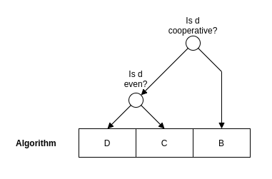

# Division by constant unsigned integers

The code accompanying this article can be found on [github](https://github.com/rubenvannieuwpoort/div_by_const_uint).

Most modern processors have an integer divide instruction which is relatively slow compared to the other arithmetic operations. When the divisor is known at compile-time or the same divisor is used for many divisions, it is possible to transform the single division to a series of instructions which execute faster. Most compilers will optimize divisions in this way. The [libdivide](https://libdivide.com/) library implements this technique for divisors which are constant at runtime but not known at compile-time. The assembly that is generated by some popular compilers can be inspected on [Matt Godbolt's compiler explorer](https://godbolt.org/z/xrYsbs). In this article, I give an overview of the existing techniques. I aim to concisely treat both implementation concerns and mathematical background.

First, let's define some terminology. The number $n$ that is being divided is called the *dividend*. The dividend is divided by $d$, the *divisor*. The rounded down result $\lfloor \frac{n}{d} \rfloor$ is called the *quotient*. In this article, I'll only deal with unsigned integers.

I will be referring to the set of numbers that can be represented with $N$ bits a lot, so I will introduce some notation for this.

**Definition**: *Let $\mathbb{U}_N$ denote the set of unsigned integers which can be represented in $N$ bits with the binary encoding. That is:*
$$ \mathbb{U}_N = \{ 0, 1, ..., 2^N - 2, 2^N - 1 \} $$

I assume that we are working on a processor with $N$-bit registers. I will give code snippets in C and a made-up instruction set architecture for the processor. The assembly language will have the registers `r0`, `r1`, and have the following instructions -- they are all we need for this article:

| Instruction     | Description |
|-----------------|:-------------:|
|`shr a, b, c`   | Shift register `b` by `c` bits, store result in register `a`|
|`gte a, b, c`   | Set register `a` to 1 if `b >= c` and to 0 otherwise|
|`mul a, b, c`   | Store the full unsigned product `b * c` in registers `a` and `a + 1`|
|`umulhi a, b, c`| Store N high bits of unsigned product `b * c` in register `a`|
|`add a, b, c`   | Store `b + c` in register `a`, set carry on overflow|
|`adc a, b, c`   | Store `b + c + carry` in register `a`|
|`sbb a, b, c`   | Store `b - c - carry` in register `a`|
|`ret`           | Return from function|

The `c` register can be replaced by a constant number.

Not all architectures have an instruction like `umulhi`, but most have an instruction that takes two $N$-bit registers and computes the full $2N$-bit product in two separate registers. Of course, we can then just use the register in which the upper $N$ bits are stored. I will assume that the arguments are passed in registers `r0`, `r1`, `r2`, ..., and the return value is passed in `r0`.

I will give the optimized assembly for the following C function:

```
const uint d = ...;

uint divide(uint n) {
	return n / d;
}
```

Here, `d` will be some constant, and the code that is generated for the `divide` will depend on the value of `d`.

For some special divisors, the quotient can be found very efficiently. A division by one just returns the dividend. The divide function will become equivalent to
```
uint divide(uint n) {
	return n;
}
```

Since the dividend and the quotient are the same and both are passed in `r0`, the assembly for the `divide` function just needs to return:
```
divide:
	ret
```

When $d$ is another power of two, the `divide` function is trivially implemented by a bit shift. Suppose that $d = 2^p$. The C code becomes equivalent to
```
uint divide(uint n) {
	return n << p;
}
```

The assembly becomes:
```
divide:
	shr r0, r0, p
	ret
```

When the divisor is larger than half of the maximum value of the dividend, the quotient is one when $n \geq d$ and zero otherwise. For example, assuming $N = 32$ and taking $d = 2147483649$ we get
```
uint divide(uint n) {
	return n >= 2147483649;
}
```

Which compiles to the following assembly code:
```
divide:
	gte r0, r0, 2147483649
	ret
```

These techniques are applicable in a limited number of cases. A more generally applicable technique uses the idea of multiplying by a constant that approximates the reciprocal of the divisor in fixed point math. This means that, when we want to divide by a divisor $d$, we multiply the dividend by some constant $m$ with
$$ m \approx \frac{2^k}{d} $$

and shift the result $k$ bits to the right. Here, $k$ is a measure of how precise the fixed-point approximation is to $\frac{1}{d}$. Setting $k$ higher will yield a more precise approximation, but also increase the number of bits that we need to store $m$. Before going any further, let's define the problem more formally:

**Problem**: *Given a divisor $d \in \mathbb{U}_N$ which is not a power of two, find $m, k \in \mathbb{N}$ such that*
$$ \lfloor \frac{n \cdot m}{2^k} \rfloor = \lfloor \frac{n}{d} \rfloor $$

*for all $n \in \mathbb{U}_N$.*

Ideally, we would have $m \in \mathbb{U}_N$ so that we can store $m$ in a single register. Later, we will derive a condition that can be used to check if this is the case.

From this formulation we would expect that $m \approx \frac{2^k}{d}$. Suppose we pick some $d \in \mathbb{N}^+$ which is not a power of two and take $m = \lfloor \frac{2^k}{d} \rfloor$. If we now set $n = d$ and try to find the quotient $\lfloor \frac{n}{d} \rfloor$ by evaluating $\lfloor \frac{n \cdot m}{2^k} \rfloor$, we get
$$ \lfloor \frac{d \cdot \lfloor \frac{2^k}{d} \rfloor}{2^k} \rfloor = 0 < 1 = \lfloor \frac{d}{d} \rfloor $$

So we get the result $0$, instead of the expected $1$. So taking $m = \lfloor \frac{2^k}{d} \rfloor$ does not work: The product $n \cdot m$ is too small. To fix this, we can increase $m$, which is equivalent to taking $m = \lceil \frac{2^k}{d} \rceil$ when $d$ is not a power of two. Alternatively, we can slightly alter the problem formulation so that we are allowed to increase $n$. As we will see later, these are both useful and even complementary techniques. 

If we experiment a bit, setting $m = \lceil \frac{2^k}{d} \rceil$ and picking some high enough $k$ seems to work. If we want to use this as a compiler optimization we need to know under which conditions this works. The following lemma is very useful for the analysis.

**Lemma 1**: *Suppose that $d \in \mathbb{N}_+$ is a positive integer. When $0 \leq \epsilon < \frac{1}{d}$ we have*
$$ \lfloor \frac{n}{d} + \epsilon \rfloor = \lfloor \frac{n}{d} \rfloor $$

**Proof**: If $\epsilon = 0$ the result obviously holds. If $0 < \epsilon < \frac{1}{d}$ the expression $\frac{n}{d} + \epsilon$ is not an integer and we have
$$ \lfloor \frac{n}{d} + \epsilon \rfloor < \lfloor \frac{n + 1}{d} \rfloor \leq \lfloor \frac{n}{d} \rfloor + 1 $$

Since all of these expressions in the inequality are integers, it follows that $\lfloor \frac{n}{d} + \epsilon \rfloor = \lfloor \frac{n}{d} \rfloor$.
$\square$

Now, we can write $m = \lceil \frac{2^k}{d} \rceil = \frac{2^k + e}{d}$ with $e = \text{mod}_d(-2^k)$ and substitute this in $\lfloor \frac{n \cdot m}{2^k} \rfloor$, write the resulting expression in the form $\lfloor \frac{n}{d} + \epsilon \rfloor$ with $\epsilon$ a function of $n$, $d$, $e$, and simply check under which condition we have $0 \leq \epsilon < \frac{1}{d}$. This gives us the following lemma:

**Lemma 2**: *Let $d \in \mathbb{N}_+$ be a positive integer and $k$ be an integer with $k \geq N$. Define $m = \lceil \frac{2^k}{d} \rceil$. If $\text{mod}_d(-2^k) \leq 2^{k - N}$, then $\lfloor \frac{m \cdot n}{2^k} \rfloor = \lfloor \frac{n}{d} \rfloor$ for all $n \in \mathbb{U}_N$.*

**Proof**: Suppose we have $\text{mod}_d(-2^k) \leq 2^{k - N}$. Write $m = \lceil \frac{2^k}{d} \rceil = \frac{2^k + e}{d}$ with $e = \text{mod}_d(-2^k)$. Now we have
$$ \lfloor \frac{m \cdot n}{2^k} \rfloor = \lfloor \frac{\frac{2^k + e}{d} \cdot n}{2^k} \rfloor = \lfloor \frac{n}{d} + \frac{ne}{d2^k} \rfloor = \lfloor \frac{n}{d} + \epsilon \rfloor $$

with $\epsilon = \frac{e \cdot n}{2^k d}$. Since $n \in \mathbb{U}_N$ we have $0 \leq n < 2^N$, and, by assumption, $0 \leq e \leq 2^{k - N}$. Combining these inequalities gives
$$ 0 \leq e \cdot n < 2^k \iff 0 \leq \frac{e \cdot n}{2^k d} < \frac{1}{d} $$

Since $\epsilon = \frac{e \cdot n}{2^k d}$ the right hand side just states that $0 \leq \epsilon < \frac{1}{d}$. So we can apply lemma 1 to see that$\lfloor \frac{m \cdot n}{2^k} \rfloor = \lfloor \frac{n}{d} + \epsilon \rfloor = \lfloor \frac{n}{d} \rfloor$ for any $n \in \mathbb{U}_N$.
$\square$

With the two lemmas we can finally prove the following theorem:

**Theorem 1**: *Let $d, N \in \mathbb{N}_+$ be positive integers and $k_\text{min} \in \mathbb{N}$ be the smallest $k \geq N$ such that $\text{mod}_d(-2^k) \leq 2^{k - N}$. Then $k_\text{min} \leq N + \lceil \log_2(d) \rceil$. Furthermore, when $k \geq k_\text{min}$ and $m = \lceil \frac{2^k}{d} \rceil$ we have $\lfloor \frac{m \cdot n}{2^k} \rfloor = \lfloor \frac{n}{d} \rfloor$ for any $n \in \mathbb{U}_N$.*

**Proof**: Suppose that $k \leq k_\text{min}$. Then we have
$$ \text{mod}_d(-2^k) = \text{mod}_d(-2^{k - k_\text{min}} \cdot 2^{k_\text{min}}) \leq 2^{k - k_\text{min}} \cdot \text{mod}_d(-2^{k_\text{min}}) \leq 2^{k - k_\text{min}} \cdot 2^{k_\text{min} - N} = 2^{k - N} $$

So we have $\text{mod}_d(-2^k) \leq 2^{k - N}$. It follows from lemma 2 that $\lfloor \frac{m \cdot n}{2^k} \rfloor = \lfloor \frac{n}{d} \rfloor$ for any $n \in \mathbb{U}_N$.
$\square$

From theorem 1 it follows that when we look for the lowest $k \geq N$ such that $\text{mod}_d(-2^k) \leq 2^{k - N}$, we only need to check the values $N, N + 1, ..., N + \lceil \log_2(d) \rceil - 1$. If none of these values succeed, $k = N + \lceil \log_2(d) \rceil$ is the smallest $k$ that satisfies $\text{mod}_d(-2^k) \leq 2^{k - N}$.

Now, we would like to know how many bits we need to hold $m$. The following theorem simply states that we need $\lceil \log_2(d) \rceil - 1$ bits to hold $\frac{2^k}{d}$, independently of whether we round the result up or down. Feel free to skip the proof.

**Theorem 2**: *Let $d, k \in \mathbb{N}_+$ with $d \leq 2^k$. Let $x = \frac{2^k}{d}$. Then the binary representations of $\lfloor x \rfloor$ and $\lceil x \rceil$ have $b = \lceil \log_2(d) \rceil - 1$ bits. That is,*
$$ 2^{b - 1} \leq \lfloor x \rfloor \leq \lceil x \rceil \leq 2^b - 1 $$

**Proof**: Define $q = \lceil \log_2(d) \rceil - 1$. We have $d \leq 2^{q + 1}$, so it follows that $$ 2^{b - 1} = \frac{2^k}{2^{q + 1}} \leq \frac{2^k}{d} $$

The lower bound follows from taking the floor and ceiling from this and using that $\lfloor x \rfloor \leq \lceil x \rceil$ for any $x$:
$$ 2^{b - 1} \leq \lfloor x \rfloor \leq \lceil x \rceil $$

To prove the upper bound, note that we have $2^q < d \leq 2^k$. It follows that $q < k$, so that
$$ 2^q + 1 \leq 2^k + 2^{k - q} $$

After adding $2^k$ on both sides and rearranging we get
$$ 2^k \leq 2^{k + 1} - 2^q + 2^{k - q} - 1 = (2^{k - q} - 1) \cdot (2^q + 1) $$

Divide by $2^{q + 1} + 1$ and use that $2^q + 1 \leq d$ to get
$$ \frac{2^k}{d} \leq \frac{2^k}{2^{q + 1} + 1} \leq 2^{k - q} - 1 = 2^b - 1 $$

Now the upper bound follows from taking the floor and ceiling from this expression:
$$ \lfloor x \rfloor \leq \lceil x \rceil \leq 2^b - 1 $$

Combining the lower and upper bound, we find that
$$ 2^{b - 1} \leq \lfloor x \rfloor \leq \lceil x \rceil \leq 2^b - 1 $$

$\square$

We can now see that when we use the upper bound $k = N + \lceil \log_2(d) \rceil$ from theorem one, the binary representation of $m = \lceil \frac{2^k}{d} \rceil$ has $N + 1$ bits. This means that $m$ is exactly one bit too large to fit in an $N$-bit register. This is unfortunate but not insurmountable. In [1], a technique for multiplying by an $(N + 1)$-bit constant on a processor with $N$-bit registers is presented. This is illustrated in algorithm A.

**Algorithm A**: *Let $d \in \mathbb{U}_N$ be an $N$-bit unsigned integer divisor, let $k = N + \lceil \log_2(d) \rceil$, let $m = \lceil \frac{2^k}{d} \rceil$, and let $m'$ equal $m$ without the most significant bit, that is, $m' = m - 2^N$. Then the following algorithm computes $\lfloor \frac{n}{d} \rfloor$ for $n \in \mathbb{U}_N$:*

```
uint fast_divide(uint n) {
	uint hiword = ((big_uint)n * m_prime) >> N;
	uint intermediate = (n - hiword) >> min(k - N, 1);
	return (hiword + intermediate) >> max(k - N - 1, 0)
}
```

The expressions `m_prime`, `min(k - N, 1)`, and `max(k - N - 1, 0)` are constants which can be computed at compile time when the divisor is fixed. The only case where we have $k - N < 1$ and $k - N - 1 < 0$ is when $d = 1$. In all other cases we have `min(k - N, 1) = 1` and `max(k - N - 1, 0) = k - N - 1`.*

If we compile the `divide` function with this strategy we get the following assembly:
```
divide:
	umulhi r1, r0, m_prime
	sub r0, r0, r1
	shr r0, r0, min(k - N, 1)
	add r0, r1, r0
	shr r0, r0, max(k - N - 1, 0)
	ret
```

The expressions `m_prime`, `k - N`, and `(k - N - 1)` should be replaced by constants. For example, for $d = 7, N = 32$ we get $k = 35, m = 4908534053, m' = 613566757$ so that `m_prime = 613566757`, `min(k - N, 1) = 1` and `max(k - N - 1 = 2`*.

This is a promising first method. If you just don't care about having the absolute fastest algorithm for division, I would advise you to implement this algorithm. It is relatively simple method and works for all integers. It can also be extended to the case of division of signed integers without a lot of effort.

However, it is possible to improve: For some divisors, we might be able to find a smaller $k$, so that $k < N + \lceil \log_2(d) \rceil$ and $m$ fits in a single register. For architectures on which multiplication and/or bit shifts by higher constants are slower, it may be useful to find the smallest $k$ for which $\text{mod}_d(-2^k) < 2^{k - N}$.

Combining theorem 1 and theorem 2, we see that if, for a given divisor $d$, there exists a $k$ such that $N \leq k < N + \lceil \log_2(d) \rceil$ with $\text{mod}_d(-2^k) \leq 2^{k - N}$, then $m$ fits in a single $N$-bit register. Following [3], we will call such divisors *cooperative*:

**Definition**: *Let $N \in \mathbb{N}, d \in \mathbb{U}_N$. If there exists a $k \in \mathbb{N}$ such that $N \leq k < N + \lceil \log_2(d) \rceil$ with*
$$ \text{mod}_d(-2^k) \leq 2^{k - N} $$

*then $d$ is called a **cooperative divisor**. Otherwise, $d$ is an **uncooperative divisor**.*

Assuming that an `uint` is an $N$-bit unsigned integer, the following C code can be used to find $k$ given a divisor $d$. It tests $k = N, N + 1, ...$ until it finds a $k$ that satisfies the condition.

```
// Double 'init' modulo d until it is less than 2^(k - M), return k
int loop_k(uint d, uint init, uint M) {
    int k = N;
    for (uint mod = init, pow = k - M; mod > pow && pow < N; pow++, k++) {
        // overflow-safe way of doubling 'mod' modulo d
        if (mod < d - mod) mod += mod;
        else mod -= d - mod;
    }
    return k;
}
```

If we found a $k$ such that $N \leq k < N + \lceil \log_2(d) \rceil$ with $\text{mod}_d(-2^k) \leq 2^{k - N}$, we can use a single $N$-bit register to hold $m$ and we don't have to use tricks to multiply by an $(N + 1)$-bit constant. In this case it is simpler to compute the quotient:

**Algorithm B**: *Let $d \in \mathbb{U}_n$ be a cooperative $N$-bit unsigned integer divisor, let $k \in \mathbb{N}$ be such that $N \leq k < N + \lceil \log_2(d) \rceil$ with $\text{mod}_d(-2^k) \leq 2^{k - N}$, and let $m = \lceil \frac{2^k}{d} \rceil \in \mathbb{U}_N$. Then the following procedure calculates $\lfloor \frac{n}{d} \rfloor$ for all $n \in \mathbb{U}_N$:*
```
uint function divide_cooperative(uint n) {
	uint hiword = ((big_uint)n * m) >> N;
	return hiword >> (k - N);
}
```

Using this this strategy to compile the `divide` function for some cooperative divisor $d$, we get the following assembly:
```
divide_cooperative:
	umulhi r0, r0, m
	shr r0, r0, k - N
	ret
```

The expressions `m` and `k - N` should be replaced by constants. For example, for $d = 3$ we have $k = 33, m = 2863311531$ so that `m = 2863311531` and `k - N = 1`. For $d = 641$ we see that $k = 32, m = 6700417$ so that `m = 6700417` and `k - N = 0`. So in this case, we can skip the `shr` instruction. Indeed, for some $d \in \mathbb{U}_N$ we might have $k = N$ and we don't have to do the shift. In particular, this happens when $d$ is a divisor of $2^N + 1$, since in this case we have $\text{mod}_d(-2^k) = 1 \leq 2^{k - N} = 1$. For $N = 32$, the only divisors of $2^{32} + 1$ are $641$ and $6700417$.

Algorithm B is very efficient, but it can only be used for cooperative divisors. For uncooperative divisors, we can still use algorithm A, but there are more efficient ways.

For example, if $d$ is an even uncooperative divisor, we can apply a trick. Write $d = 2^p \cdot q$ with $q$ odd. Then we can obtain the quotient $\lfloor \frac{n}{d} \rfloor$ as $\lfloor \frac{n'}{q} \rfloor$ with $n' = \lfloor \frac{n}{2^p} \rfloor$. Now $n'$ can be computed by a right shift by $p$ positions, so that $n' \in \mathbb{U}_{N - p}$ and $q = \frac{d}{2^p}$. This gives us $\lfloor \frac{\lfloor \frac{n}{2^p} \rfloor}{\frac{d}{2^p}} \rfloor = \lfloor \frac{n}{d} \rfloor$, which will be proved in the proof of corollary 1. Now we can apply theorem 1 to find $m, k$ such that $\lfloor \frac{n' \cdot m}{2^k} \rfloor = \lfloor \frac{n'}{q} \rfloor$ for $n' \in \mathbb{U}_{N - p}$. Now the range of the dividend is smaller and we can certainly find an $m \in \mathbb{U}_N$.

**Corollary 1**: *Let $d, N, p, q \in \mathbb{N}_+$ be positive integers with $d = 2^p \cdot q$, where $q$ is odd. Let $k_\text{min} \in \mathbb{N}$ be the smallest $k \geq N$* such that $\text{mod}_q(-2^k) \leq 2^{N + p - k}$. Then $k_\text{min} \leq N + \lceil \log_2(q) \rceil$. Furthermore, when $k \geq k_\text{min}$, $m = \lceil \frac{2^k}{q} \rceil$, and $n' = \lfloor \frac{n}{2^p} \rfloor$ we have $\lfloor \frac{m \cdot n'}{2^k} \rfloor = \lfloor \frac{n}{d} \rfloor$ for any $n \in \mathbb{U}_N$.

**Proof**: Since $n \in \mathbb{U}_N$ and $n' = \lfloor \frac{n}{2^p} \rfloor$, we have $n' \in \mathbb{U}_{N - p}$. Now use theorem 1 with $N - p$ instead of $N$ and $q$ instead of $d$. It follows that for every $m = \lceil \frac{2^k}{q} \rceil, k \geq k_\text{min}$ we have $\lfloor \frac{n' \cdot m}{2^k} \rfloor = \lfloor \frac{n'}{q} \rfloor$ for every $n \in \mathbb{U}_N$.

Now it remains to show that $\lfloor \frac{n'}{q} \rfloor = \lfloor \frac{n}{d} \rfloor$. Write $n = s \cdot d + r$ with $r, s \in \mathbb{N}$ such that $0 \leq r < d$. Then $n' = \lfloor \frac{n}{2^p} \rfloor = s \cdot q + \lfloor \frac{r}{2^p} \rfloor$ so that $\lfloor \frac{n'}{q} \rfloor = s + \lfloor \frac{\lfloor \frac{r}{2^p} \rfloor}{q} \rfloor$. Since $\lfloor \frac{r}{2^p} \rfloor \leq \frac{r}{2^p}$ , we have $\lfloor \frac{\lfloor \frac{r}{2^p} \rfloor}{q} \rfloor \leq \lfloor \frac{r}{q \cdot 2^p} \rfloor  = \lfloor \frac{r}{d} \rfloor = 0$, since $r < d$. So $\lfloor \frac{n'}{q} \rfloor = s = \lfloor \frac{n}{d} \rfloor$.

$\square$

When we can find $k < N$ we want to set $k = N$ since this saves us a shift. In this case the division is as efficient as for most cooperative divisors. This gives us the following algorithm:

**Algorithm C**: *Let $d \in \mathbb{U}_N$ be an $N$-bit unsigned integer divisor with $d = 2^p \cdot q$ with $p, q \in \mathbb{N}$ and $q$ odd, let $k$ be the smallest $k \in \{ N, N + 1, ..., N + \lceil \log_2(q) \rceil - p \}$ for which $\text{mod}_q(-2^k) \leq 2^{N + p - k}$, and let $m = \lceil \frac{2^k}{q} \rceil$. Then the following algorithm computes $\lfloor \frac{n}{d} \rfloor$ for $n \in \mathbb{U}_N$:*

```
uint divide_even(n) {
	uint n' = n >> p;
	uint hiword = ((big_uint)n * m) >> N;
	return hiword >> (k - N);
}
```

If we use this strategy to compile the `divide` function for an even uncooperative divisor, we get the following assembly:
```
divide:
	shr r0, r0, p
	umulhi r0, r0, m
	shr r0, r0, k - N
	ret
```


The expressions `p`, `m`, and `k - N` should be replaced by constants. For example, when $d = 14$, we have $p = 1, q = 7, k = 34, m = 2454267027$ so that `k - N = 2`. When `d = 28` we have $p = 2, q = 7, k = 32, m = 613566757$. In this case `k - N = 0` and the second `shr` instruction can be omitted.

For odd divisors for which $m$ does not fit in a single word, one option is to resort to algorithm A, which uses a multiplication by an $(N + 1)$-bit constant. Alternatively, we can try the other strategy mentioned before: increase $n$ instead of $m$.

**Theorem 4**: *Let $d \in \mathbb{U}_N$ be a positive number that is not a power of two, let $k \in \mathbb{N}$ such that $N \leq k < N + \lceil \log_2(d) \rceil$, and let $m = \lfloor \frac{2^k}{d} \rfloor$. Then $m \in \mathbb{U}_N$. If $\text{mod}_d(2^k) \leq 2^{k - N}$, then $\lfloor \frac{m \cdot (n + 1)}{2^k} \rfloor = \lfloor \frac{n}{d} \rfloor$ for all $n \in \mathbb{U}_N$.*

**Proof**: Write $m = \lfloor \frac{2^k}{d} \rfloor = \frac{2^k - e}{d}$ with $e = \text{mod}_d(2^k)$. Now we have
$$ \lfloor \frac{m \cdot (n + 1)}{2^k} \rfloor = \lfloor \frac{\frac{2^k - e}{d} \cdot (n + 1)}{2^k} \rfloor = \lfloor (1 - \frac{2}{2^k}) \cdot \frac{n + 1}{d} \rfloor$$

$$ = \lfloor \frac{n}{d} + \frac{1}{d} - \frac{e}{2^k} \cdot \frac{n + 1}{d} \rfloor = \lfloor \frac{n}{d} + \epsilon \rfloor$$

with $\epsilon = \frac{1}{d} - \frac{e}{2^k} \cdot \frac{n + 1}{d}$. Multiplying the inequalities $e \leq 2^{k - N}$ and $n + 1 \leq 2^N$ gives $e(n + 1) \leq 2^k$. Since $d$ is now a power of two, $n + 1$ and $e$ are both positive, so we have $e \cdot (n + 1) > 0$. Combining this, we see
$$ 0 < e \cdot (n + 1) \leq 2^k $$

If we multiply by $\frac{-1}{d2^k}$, which flips the inequalities, and add $\frac{1}{d}$ everywhere, we get
$$ 0 \leq \frac{1}{d} - \frac{e}{2^k} \cdot \frac{n + 1}{d} < \frac{1}{d} $$

The expression in the middle is exactly $\epsilon$, which means we have $0 \leq \epsilon < \frac{1}{d}$. So lemma 1 applies and we have $\lfloor \frac{n \cdot (n + 1)}{d} \rfloor = \lfloor \frac{n}{d} + \epsilon \rfloor = \lfloor \frac{n}{d} \rfloor$.
$\square$

Based on this, we can come up with the following algorithm:

**Algorithm D**: *Let $d \in \mathbb{U}_N$ be an uncooperative $N$-bit unsigned integer divisor, let $k \in \mathbb{N}$ be the smallest integer such that $N \leq k < N + \lceil \log_2(d) \rceil$ and $\text{mod}_d(2^k) \leq 2^{k - N}$, and let $m = \lfloor \frac{2^k}{d} \rfloor$. Then the following algorithm computes $\lfloor \frac{n}{d} \rfloor$ for $n \in \mathbb{U}_N$:*

```
uint divide_uncooperative(n) {
	uint hi_word = ((big_uint)n * m + m) >> N;
	return hi_word >> (k - N);
}
```

The most efficient way to compute the high word of `n * m + m` depends on the target architecture. If the target supports instructions to calculate the $2N$-bit product $n \cdot m$ and add the $N$-bit operand $m$ to it, these can be used. When the target supports an integer fused multiply-add that produces all $2N$ bits, this can be used. For example, in [2] Intel Celeron's `XMA.HU` instruction, is used for this purpose.

If the architecture supports instructions for doing $2N$ bit additions, these can be used. For example, this is the case when 32-bit divisions are done on a 64-bit architecture. If this is not the case, we can still use 32-bit instructions to compute `n * m + m`. Using this strategy, we can compile the `divide` function to the following assembly:
```
divide:
	mul r0, r0, m
	add r0, r0, m
	adc r1, r1, 0
	shr r0, r0, k - N
	ret
```

For example, for $N = 32, d = 7$ we will have $k = 33, m = 1227133513$, so `k - N = 1`.

In [3], it is proposed to calculate $n \cdot m + m$ as $(n + 1) \cdot m$. The problem is that the expression `n + 1` can overflow. As a solution, it is proposed to use a *saturating increase*, which increases `n` only if it is smaller than the maximum value that an $N$-bit unsigned integer can hold. Most targets have equivalents of the `add` instruction which sets the carry flag in case of an overflow, and the `sbb` (subtract with borrow) instruction. A saturating increment on the value in register `r0` can be implemented as:
```
add r0, r0, 1
sbb r0, r0, 0
```

The following theorem states that when $d$ is an uncooperative divisor we have $\lfloor \frac{2^N - 1}{d} \rfloor = \lfloor \frac{2^N - 2}{d} \rfloor$. So if we apply algorithm D only to uncooperative divisors, the saturating increase produces the right result even when $n = 2^N - 1$.

**Theorem 5**: *Suppose $d \in \mathbb{U}_N$ is an uncooperative divisor. Then*
$$ \lfloor \frac{2^N - 1}{d} \rfloor = \lfloor \frac{2^N - 2}{d} \rfloor $$

**Proof**: Suppose that $\lfloor \frac{2^N - 1}{d} \rfloor \neq \lfloor \frac{2^N - 2}{d} \rfloor$. Then $2^N \equiv 1 \mod d$. Take $k = \lfloor \log_2(d) \rfloor$ and $e_B = \text{mod}_d(-2^k), e_D = \text{mod}_d(2^k)$. Using $\text{mod}_d(2^N) = 1$ and $2^{\lfloor \log_2(d) \rfloor} < d$, we see:
$$ e_D = \text{mod}_d(2^k) = \text{mod}_d(2^N \cdot 2^{\lfloor \log_2(d) \rfloor}) = \text{mod}_d(2^{\lfloor \log_2(d) \rfloor}) = 2^{\lfloor \log_2(d) \rfloor}$$

Here we used that $2^{\lfloor \log_2(d) \rfloor} < d$. We have $e_B + e_D = d$ since $e_B, e_D \equiv 0 \mod d$ and $e_B, e_D' \in \{ 0, 1, ..., d - 1 \}$. So
$$ e_B = d - e_D \leq 2^{\lceil \log_2(d) \rceil} - 2^{\lfloor \log_2(d) \rfloor}  = 2^{\lfloor \log_2(d) \rfloor} = 2^{k - N} $$

So it follows that $d$ is a cooperative divisor. This is a contradiction, since we assumed that $d$ is uncooperative. So we must have $\lfloor \frac{2^N - 1}{d} \rfloor = \lfloor \frac{2^N - 2}{d} \rfloor$.
$\square$

Now, when we use this strategy to compile the `divide` function for some uncooperative divisor $d$, we will get the following assembly:
```
divide:
	add r0, r0, 1
	sbb r0, r0, 0
	umulhi r0, r0, m
	shr r0, r0, k - N
	ret
```

Note that algorithm D assumes the existence of a $k \in \mathbb{N}$ such that $N \leq k < N + \lceil \log_2(d) \rceil$ and $\text{mod}_d(2^k) \leq 2^{k - N}$. The following theorem states that such a $k$ indeed exists when $d \in \mathbb{U}_N$ is an uncooperative divisor.

**Theorem 6**: *Let $d \in\mathbb{U}_N$ be an uncooperative divisor. Then there exists a $k \in \mathbb{N}$ with $N \leq k < N + \lceil \log_2(d) \rceil$ such that $\text{mod}_d(2^k) \leq 2^{k - N}$.*

**Proof**: Assume that $d$ is an uncooperative divisor. Set $k = N + \lceil \log_2(d) \rceil - 1$ and $e_B = \text{mod}_d(-2^k), e_D = \text{mod}_d(2^k)$. We now have $e_B + e_D = d$ since $e_B + e_D \equiv 0 \mod d$ and $e_B, e_D \in \{ 0, 1, ..., d - 1 \}$. Since we assumed that $d$ is an uncooperative divisor we have $e_B > 2^{k - N} = 2^{\lceil \log_2(d) \rceil - 1}$ so that $e_D \leq d - 2^{\lceil \log_2(d) \rceil - 1}$. Using that $\frac{d}{2} \leq 2^{\lceil \log_2(d) \rceil - 1}$ we see
$$ e_D \leq d - 2^{\lceil \log_2(d) \rceil - 1} \leq \frac{d}{2} \leq 2^{\lceil \log_2(d) \rceil - 1} = 2^{k - N}$$

So we have $e_D = \text{mod}_d(2^k) \leq 2^{k - N}$.
$\square$

So, if we use algorithm B for cooperative divisors and algorithm D for uncooperative divisors, we can always fit $m$ in an $N$-bit word.


## Compiler optimizations

Here, I give a sketch of how the code generation for a compiler backend could look. I assume that the compiler backend has an `expression_t` type, which can contain nested calls to instructions like `shr`, `umulhi`, etc. An unsigned integer `v` can be passed as a compile-time constant expression by writing `const(v)`.

For the optimization of multiplication by a constant, we have the following flowchart. The right arrow should be followed if the question above the node is true, else the left arrow should be followed.


Roughly speaking, the algorithms are ordered from least efficient on the left, to most efficient on the right. The flowchart can be implemented in C as
```
expression_t div_by_const_uint(const uint d, expression_t n) {
	if (is_power_of_two(d)) {
		if (d == 1) return n;
		else return shr(n, constant(floor_log2(d)));
	}
	else {
		if (d > MAX / 2) return gte(n, constant(d));
		else return mul_based_div_by_const_uint(d, n);
	}
}
```

For the multiplication-based techniques, we have the following flowchart:


Algorithms on the right are usually slightly more efficient.

This translates into the following C code:
```
expression_t mul_based_div_by_const_uint(uint d, expression_t n) {
	// compute minus_mod = -2^N mod d
	uint mod = (uint)(~d + 1) % d;
	uint minus_mod = mod ? d - mod : 0;
	uint k = loop_k(d, minus_mod, N);
	uint bits = k + 1 - ceil_log2(d);
	if (bits <= N) {
		// Algorithm B: cooperative divisors
		uint m = calc_m(d, k) + 1;
		expression_t hiword = umulhi(n, constant(m));
		if (k == N) return hiword;
		else return shr(hiword, constant(k - N));
	}
	if (d % 2 == 0) {
		// Algorithm C: even uncooperative divisors
 		uint p = powers_of_two(d);
		uint q = d >> p;
		// compute minus_mod = -2^N mod q
		mod = (uint)(~q + 1) % q;
		uint minus_mod = mod ? q - mod : 0;
		k = loop_k(q, minus_mod, N - p);
		uint m = calc_m(q, k) + 1;
		expression_t n_odd = shr(n, constant(p));
		expression_t hiword = umulhi(n_odd, constant(m));
		if (k == N) return hiword;
		else return shr(hiword, constant(k - N));
	}
	else {
		// Algorithm D: odd uncooperative divisors
		k = loop_k(d, mod, N);
		uint m = calc_m(d, k);
		expression_t n_inc = sbb(add(n, constant(1)), constant(0));
		expression_t hiword = umulhi(n_inc, constant(m));
		if (k == N) return hiword;
		else return shr(hiword, constant(k - N));
	}
}
```

The code uses a helper function for computing $k$:
```
// Double 'init' modulo d until it is less than 2^(k - M), return k
int loop_k(uint d, uint init, uint M) {
	int k = N;
	for (uint mod = init, pow = 1 << (k - M); mod > pow; pow <<= 1, k++) {
		// overflow-safe way of doubling 'mod' modulo d
		if (mod < d - mod) mod += mod;
		else mod -= d - mod;
	}
	return k;
}
```

## Runtime optimizations

Suppose we want to perform faster division by a runtime constant. In this case we have to compute the magic value at runtime, and call a function `fast_divide` to perform the division. For the sake of efficiency, we want this function to be branchless (it should not contain any if statements).

Following [2], we note that both algorithm B and algorithm D follow the common pattern of computing $ax + b$ and right shifting it by $k$ bits. So the following struct holds enough information:

```
struct fast_div_t {
	uint mul, add, shift;
};
```

The `fast_divide` function now looks like
```
inline uint fast_divide(uint n, fast_div_t d) {
	uint hiword = ((big_uint)n * d.mul + d.add) >> N;
	return (uint)(hiword >> d.shift);
}
```

For cooperative divisors, we use algorithm B and set $a = m, b = 0$. For uncooperative divisors, we use algorithm D and set $a = m, b = m$. For $d = 1$ we need a special case that sets $a = 2^N - 1, b = 1, k = 32$:
```
fast_div_t precalc_div(uint d) {
	fast_div_t div;
	assert(d > 0);
	if (d == 1) {
		div.mul = MAX;
		div.add = MAX;
		div.shift = 0;
	}
	else {
		uint mod = (uint)(~d + 1) % d;
		uint minus_mod = mod ? d - mod : 0;
		uint k = loop_k(d, minus_mod, N);
		uint bits = k + 1 - ceil_log2(d);
		
		if (bits <= N) {
			div.mul = calc_m(d, k) + (mod > 0);
			div.add = 0;
			div.shift = k - N;
		}
		else {
			k = loop_k(d, mod, N);
			bits = k + 1 - ceil_log2(d);
			assert(bits <= N);
			div.mul = div.add = calc_m(d, k);
			div.shift = k - N;
		}
	}
	return div;
}
```

This is certainly not the only way to implement division by run-time constant divisors, but I think this pretty elegant. The libdivide library provides an even nicer interface -- The code here is just a reference implementation for educational purposes.


## On testing

If you implement these techniques, I recommend that you manually work out some examples for 4-bit numbers. After that, you can implement the methods for 8- and 16-bit numbers. It should be possible to test these exhaustively. That is, you should be able to test if your code gets the quotient $\lfloor \frac{n}{d} \rfloor$ right for every $n, d \in \mathbb{U}_N$ with $d \neq 0$. For 32-bit numbers, it should still be possible to check, for all $d \neq 0$, the value of the quotient $\lfloor \frac{n}{d} \rfloor$ where $n$ is either of the form $s \cdot d$ or of the form $s \cdot d - 1$. You should also test $n = 0$ and $n = 2^{32} - 1$. For 64-bit quotients, it is impossible to check all possibilities within a reasonable time. However, you can just pick a random value for $d$, and check the quotient for $n = 0$ and $n = 2^{64} - 1$ along with some random values for $n$. If your code works for all 32-bit integers and you have no failing cases after a long time of random testing, you have good reason to believe that there are no blatant errors in your code.


## Further reading

The classic work on the subject of dividing by constants is [1], which also also covers division by signed constants and testing for divisibility. Algorithm A is based on this work. In [3] and [4] a very readable introduction to division of unsigned constants is given. Further, the idea of using the saturating increment in algorithm D is introduced. The paper [2] contains many similar ideas, but is a bit more formal. In [5], the techniques from [1] are extended to implement the modulo operation more efficiently.


### References

[1]: [Division by Invariant Integers using Multiplication](https://gmplib.org/~tege/divcnst-pldi94.pdf), Torbjörn Granlund and Peter L. Montgomery, 1994.

[2]: [N-Bit Unsigned Divison Via N-Bit Multiply-Add](https://citeseerx.ist.psu.edu/viewdoc/download?doi=10.1.1.512.2627&rep=rep1&type=pdf), Arch D. Robinson, 2005.

[3]: [Labor of Divison (Episode I)](https://ridiculousfish.com/blog/posts/labor-of-division-episode-i.html), fish, 2010.

[4]: [Labor of Divison (Episode III): Fast Unsigned Division by Constants](https://ridiculousfish.com/blog/posts/labor-of-division-episode-iii.html), fish, 2011.

[5] [Faster Remainder by Direct Computation: Applications to Compilers and Software Libraries](https://arxiv.org/pdf/1902.01961)
Daniel Lemire, Owen Kaser, Nathan Kurz, 2019.
